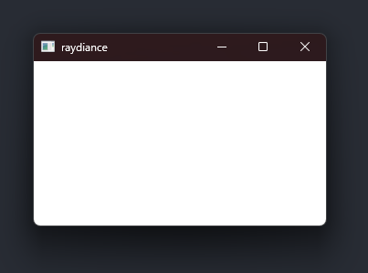

{{Meta((title:"Hello, winit!", commit:"ff4c31c2c6c2039d33bfd07865448da963febfd6"))}}

Before anything interesting can happen, we need a window to draw on. We use the
[`winit`][winit-crate] crate for windowing and handling inputs. For convenience,
we bound the Escape key to close the window and center the window in the middle
of the primary monitor.

For simple logging, we use [`log`][log-crate] and
[`env_logger`][env_logger-crate], and for application-level error handling, we
use [`anyhow`][anyhow-crate].

Next, we will slog through a huge Vulkan boilerplate to draw something on our
blank window.

[winit-crate]: https://crates.io/crates/winit
[log-crate]: https://crates.io/crates/log
[env_logger-crate]: https://crates.io/crates/env_logger
[anyhow-crate]: https://crates.io/crates/anyhow
