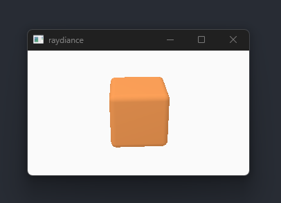
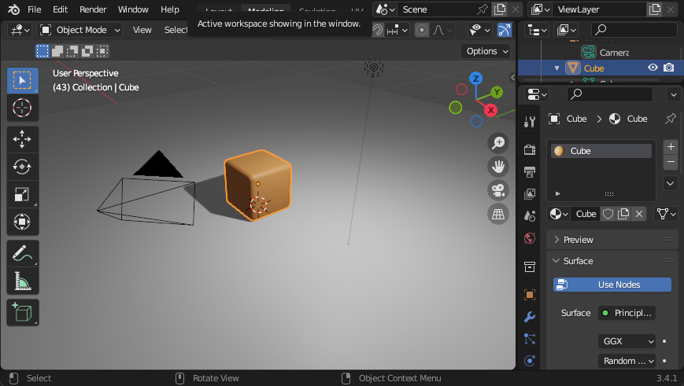
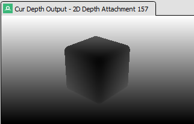

{{Meta((title:"More triangles, cameras, light, and depth", commit:"cb1bcc1975e3860b7208cffb4286fec3e91cc5d2"))}}

A lot has happened since our single hardcoded triangle. We can now render
shaded, depth tested, transformed, and indexed triangle lists with perspective
projection.

# Loading and rendering GLTF scenes

We created a simple "cube on a plane" scene in Blender. Each object has a
"Principled BSDF" material attached to it. This material is well supported by
[Blender's GLTF exporter][blender], which is what we will use for our
application. GLTF supports text formats, but we will export the scene in binary
(`.glb`) for efficiency.

To load the `.glb` file, we use [`gltf`][gltf-crate] crate. Immediately after
loading, we pick out the interesting fields (cameras, meshes, materials) and
convert them into our [internal data format][assets-rs]. We designed this
internal format to be easy to upload to the GPU. We also do aggressive
validation to catch any properties that we don't support yet, such as textures,
meshes that do not have normals, etc. Our internal formats represent matrices
and vectors with types from [`nalgebra`][nalgebra-crate] crate. To turn our
internal formats into byte slices, we use the [`bytemuck`][bytemuck-crate]
crate.

Before we can render, we need to upload geometry data to the GPU. We assume the
number of meshes is much less than 4096 (on most Windows hosts, the
[`maxMemoryAllocationCount`][gpu-info] is 4096). This assumption allows us to
cheat and allocate buffers for each mesh. The better way to handle allocations
is to make a few large allocations and sub-allocate within those, which we can
do ourselves or use a library like [`VulkanMemoryAllocator`][vma]. We will come
back to memory allocators in the future.

To render, we will have to work out the perspective projection, the view
transform, and object transforms from GLTF. We also add a rotation transform to
animate the cube. We pre-multiply all transforms and upload the final matrix to
the vertex shader using [push constants][push-constants]. We also pack the base
color into the push constant. Push constants are great for small data because we
can avoid the following:

1. Descriptor set layouts, descriptor pools, descriptor sets
2. Uniform buffers, which would have to be double buffered to avoid pipeline stalls
3. Synchronizing updates to uniform buffers

As a side, while looking into push constants, we learned about
[`VK_KHR_push_descriptor`][push-descriptor]. This extension could simplify
working with Vulkan, which is exciting. We will return to it once we get into
texture mapping.

# Depth testing with `VK_KHR_dynamic_rendering`

Depth testing requires a depth texture, which we create at startup, and
re-create when the window changes size. To enable depth testing with
`VK_KHR_dynamic_rendering`, we had to extend our graphics pipeline with a new
structure called [`VkPipelineRenderingCreateInfo`][pipeline-info] and add a
color blend state which was previously left out. One additional pipeline barrier
was required to transition the depth texture for rendering.

[blender]: https://docs.blender.org/manual/en/latest/addons/import_export/scene_gltf2.html#extensions
[gltf-crate]: https://crates.io/crates/gltf
[assets-rs]: https://github.com/phoekz/raydiance/blob/cb1bcc1975e3860b7208cffb4286fec3e91cc5d2/src/assets.rs#L3-L35
[nalgebra-crate]: https://crates.io/crates/nalgebra
[bytemuck-crate]: https://crates.io/crates/bytemuck
[gpu-info]: https://vulkan.gpuinfo.org/displaydevicelimit.php?platform=windows&name=maxMemoryAllocationCount
[vma]: https://github.com/GPUOpen-LibrariesAndSDKs/VulkanMemoryAllocator
[push-constants]: https://registry.khronos.org/vulkan/specs/1.3-extensions/html/vkspec.html#descriptorsets-push-constants
[push-descriptor]: https://registry.khronos.org/vulkan/specs/1.3-extensions/html/vkspec.html#VK_KHR_push_descriptor
[pipeline-info]: https://registry.khronos.org/vulkan/specs/1.3-extensions/html/vkspec.html#VkPipelineRenderingCreateInfo
