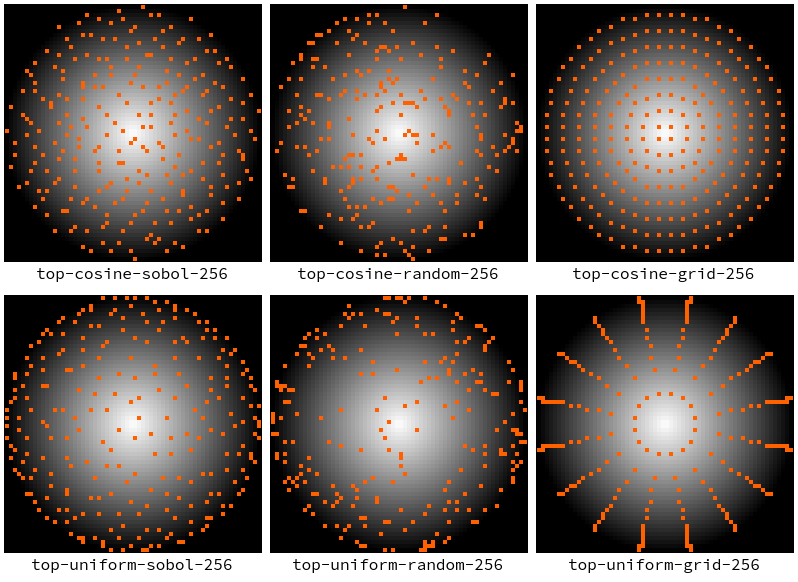
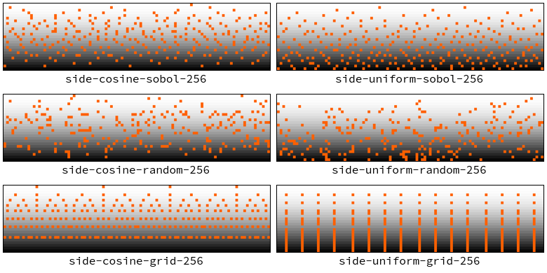

{{Meta((title:"Visualizing sample placement", commit:"f5b806749234a4086d84388d7264c0f2fd43122a"))}}

Importance sampling Disney specular models is more challenging than our current
diffuse models. To improve our chances, we created a small tool that visualizes
where the samples are placed around the hemisphere.

We used our existing uniform and cosine-weighted hemisphere samplers to ensure
the tool worked. We also added two additional sample sequences for comparison:

1. `grid` sequence, which uniformly samples the unit square.
2. `sobol` sequence, which is provided by the
   [`sobol_burley`][sobol_burley-crate] crate. The implementation is based on
   [Practical Hash-based Owen Scrambling][owen-scrambling-paper].

In terms of coordinate spaces, the `top` plots view the hemisphere from above in
cartesian space. The `side` plots in $x=\phi=[0,2\pi]$ and
$y=\theta=[0,\frac{\pi}{2}]$ hemispherical space.

For both sets of plots, the background brightness corresponds to the magnitude
of $\cos\theta$.

Looking at the plots, we can intuitively say that `cosine` performs better than
`uniform` sampling because it places samples closer to the bright spots.
Similarly, `sobol` performs better than `random` and `grid`.

Note that the new sequences are not currently available for rendering. We will
revisit low-discrepancy sequences later.

[sobol_burley-crate]: https://crates.io/crates/sobol_burley
[owen-scrambling-paper]: https://www.jcgt.org/published/0009/04/01/
