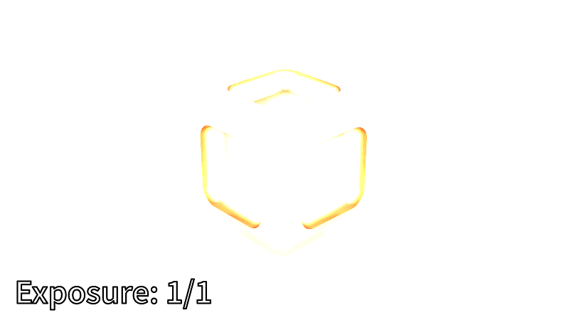

{{Meta((title:"New skylight model, tone mapping, new visualizations", commit:"9f73353bd3de949b4268f628979847b141ad7d59"))}}

{{Video((h265:"title-h265.mp4", vp9:"title-vp9.webm"))}}

This release implements a new skylight model, tone mapping, and a simple
keyframe animation system. This release also unifies all visualization systems
under a single set of tools.

# Hosek-Wilkie skylight model

Our previous lighting was a straightforward ad-hoc directional light which we
defined as:

$$
\begin{aligned}
    sun &= 0.5 + 0.5 |sun_{dir} \cdot ray_{dir}| \\
    sun_{dir} &= normalize(1, 3, 1) \\
\end{aligned}
$$

In this release, we replaced it with [An Analytic Model for Full Spectral
Sky-Dome Radiance][sky-paper] by Lukas Hosek and Alexander Wilkie. This paper
proposes a physically-based analytical model for dynamic daytime skydomes. We
can now animate the sun's position in real-time and have the model produce
realistic sunsets.

The authors wrote a brute-force path tracing simulation for gathering reference
data on atmospheric scattering. They used this reference data to create the
following model.

$$
\begin{aligned}
L_{\lambda} &= \text{spectral radiance} = 𝐅(\theta,\gamma) \cdot L_{M\lambda} \\
L_{M\lambda} &= \text{expected value of spectral radiance} \\
𝐅(\theta,\gamma) &=
    (1 + Ae^{\frac{B}{\cos\theta+0.01}})
    (C+De^{E\gamma} + F\cos^2\gamma + G\chi(H,\gamma) + I\cos^{\frac{1}{2}}\theta) \\
\chi(H,\gamma) &=
    \frac{1 + \cos^2\gamma}{(1 + H^2 - 2H\cos\alpha)^{\frac{3}{2}}} \\
\gamma &= \text{angle between view and sun directions} \\
\theta &= \text{angle between view and the zenith} \\
\text{A,B},...,\text{I} &= \text{model parameters} \\
\end{aligned}
$$

To evaluate the model, we query the model parameters $A,B,...,I$ and
$L_{M\lambda}$ from the datasets provided by the authors. Since our renderer
only supports RGB, we must use their RGB datasets.

The sky model runs fast enough to be interactive. Here's a short real-time
demonstration:

{{Video((h265:"editor-demo-h265.mp4", vp9:"editor-demo-vp9.webm"))}}

# Implementation details

The original implementation is implemented ~1000 lines of ANSI C. We could have
built it into our Rust project, but we realized that most of the code was
useless. We re-implemented the original C version into Rust with the following
changes:

- We removed spectral and CIE XYZ data sets since our renderer only support
  RGB.
- We removed the solar radiance functionality since its API only supported
  spectral radiances. However, having a solar disc increases realism, so we
  might have to revisit this later.
- We removed the "Alien World" functionality since we are only concerned with
  terrestrial skies.
- We switched from double-precision to single-precision computations and
  storage. Reduced precision did not seem to have any visual impact and
  performed better than doubles.
- The model state size went down from 1088 bytes to only 120 bytes.

With these changes, our implementation ended up being just ~200 LOC of Rust.

# Simple exposure control

With the new skylight model, we now have a problem: the scene is too bright. We
can scale the brightness down by a constant factor called $exposure$, which we
are going to define as:

$$exposure = \frac{1}{2^{stops}}, stops \geq 0$$

We apply this scaling to every pixel as the final step of the render.

# Tone mapping

{{ImagePair((left:"tonemap-compare-dim.apng", left_text:"Dim scene", right:"tonemap-compare-bright.apng", right_text:"Bright scene"))}}

We can make the image "pop" more with _tone mapping_, which is a technique for
mapping high-dynamic range (HDR) images into low-dynamic range (LDR) to be shown
on a display device. Our implementation uses the "ACES Filmic Tone Mapping
Curve," which is currently the default tone mapping curve in Unreal Engine. More
specifically, we used [Krzysztof Narkowicz's simple curve fit][aces], which
seemed simple, fast enough, and visually pleasing.

{{InlineSvg((svg:"plot.svg"))}}

We can see in the log plot that the ACES curve boosts colors between $0.1$ and
$0.7$, and then it starts to gracefully dim colors from $0.7$ to $10.0$. In
contrast, the linear curve clips from $1.0$ onwards.

# New sky dome visualizations

{{ImagePair((left:"sky-elevation.apng", left_text:"Elevation between $0..90^\circ$", right:"sky-turbidity.apng", right_text:"Turbidity between $1..10$"))}}

Building on BRDF visualizations from the previous posts, we can also visualize
the sky dome under different parameter combinations.

# Offline rendering improvements

{{Video((h265:"new-offline-render-h265.mp4", vp9:"new-offline-render-vp9.webm"))}}

The offline rendering mode from the previous post gained some improvements:

- Parameters now support simple keyframe animations. Instead of hard-coding
  animations like the swinging camera in previous posts, users can now define
  keyframes for all sky model parameters. We will continue to expand the number
  of animateable parameters in the future, such as object transforms and
  material properties.
- Offline renders can now have the same text annotations as the BRDF and the new
  skydome visualizations.

We also reviewed all our existing visualization systems and combined their
different capabilities under a single set of tools.

[sky-paper]: https://cgg.mff.cuni.cz/projects/SkylightModelling/
[aces]: https://knarkowicz.wordpress.com/2016/01/06/aces-filmic-tone-mapping-curve/
