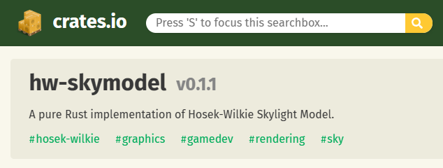

{{Meta((title:"Releasing skylight model as a crate", commit:"3069b84b8d8c5b8b455452d95e0c7386f577e046"))}}

We have released the skylight model from the previous post as a standalone crate named [`hw-skymodel`][hw-skymodel-crate]. The implementation is almost identical, except that the `new()` function returns `Result` instead of `assert!`.

Publishing into [crates.io][crates-io] was straightforward; we had to get an API key and fill in all the required fields in the `Cargo.toml` file, as mentioned in this [article][publishing].

[crates-io]: https://crates.io
[hw-skymodel-crate]: https://crates.io/crates/hw-skymodel
[publishing]: https://doc.rust-lang.org/cargo/reference/publishing.html
