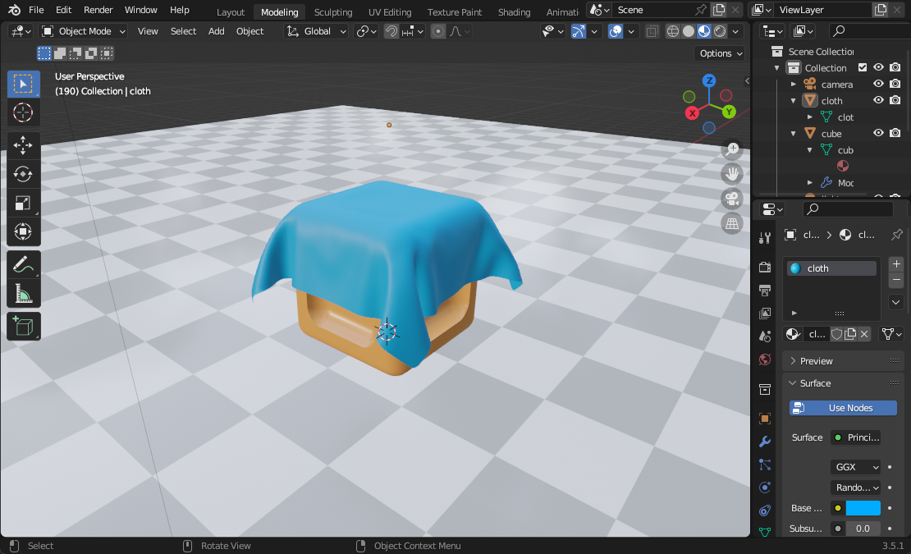

{{Meta((title:"Adding sheen", commit:"43a57981e8401fda727af8f15af298fddb35a5a9"))}}

{{Video((h265:"title-h265.mp4", vp9:"title-vp9.webm"))}}

This release implements the Disney sheen model, which adds two new parameters: $sheen$ and $sheenTint$. This model adds a new diffuse lobe that attempts to model clothing and textile materials. The effect is subtle but noticeable.

Below we can see the effect of interpolating $sheen$ and $sheenTint$ between $0$ to $1$ respectively.

{{Video((h265:"sheen-parameters-h265.mp4", vp9:"sheen-parameters-vp9.webm"))}}

Disney defines $f_{sheen}$ as:

$$
\begin{aligned}
    f\_{sheen} &= sheenColor \cdot (1- \cos \theta_d)^5 \\
    sheenColor &= sheen \cdot lerp(white, tintColor, sheenTint) \\
\end{aligned}
$$

We also added the new parameters to our debug visualization system.

{{ImagePair((left:"brdf-disney-sheen-incoming-r.apng", left_text:"Interpolating incoming direction", right:"brdf-disney-sheen-sheen_tint-r.apng", right_text:"The effect of sheen tint"))}}

# Modeling cloth geometry

We made the cloth model in Blender with these steps:

1. Create a subdivided, one-sided plane surface.
2. Apply cloth simulation with self-collision turned on.
3. Freeze the simulation into a static mesh.
4. Apply smooth shading.
5. Apply solidify modifier to turn the cloth surface into a two-sided surface with non-zero thickness. We need to do this because Raydiance does not support two-sided surfaces.
